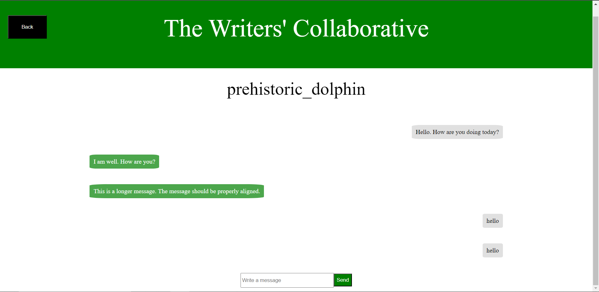

# The Writers' Collaborative

## Description
The Writers' Collaborative is an online social site in which users can share stories, rate and comment on each other's stories, and send messages to each other.

## Tech Stack
### Front End
* HTML
* CSS
* JavaScript
* HTTP Client: Axios
### Back End
* Runtime Environment: NodeJS
* Server: Express.js
* ORM: Sequelize
* Hashing: bcrypt
### Database
* Database Dialect: PostgreSQL
* Database Storage: render.com
### Deployment
* AWS
* EC2

## Features
* Users can create an account
* Users can log in with their username or email and their password
* Users can write stories and set them to either be public or private
* Authors can view their stories
* Other users can see an author's public stories
* Users can comment on public stories
* Other users can rate an author's public stories
* Users can update or delete their profile and change their password
* Users can log out
* Users can send and receive messages

## How to Use The Writers' Collaborative
Navigate to http://18.189.185.52.

### Creating an Account
1. On the home page, click the "Sign Up" button.
2. Enter the requested information and click "Submit".

### Logging In
1. On the home page, click the "Log In" button.
2. Enter your username/email and your password and click "Submit".

### Creating a Story
1. Sign up for or log into The Writers' Collaborative.
2. Click the "Write a Story" button on the home page.

##### Alternative
1. Sign up for or log into The Writers' Collaborative.
2. Click the "Profile" button.
3. Click the "Write a Story" button on the profile page.

### Reading a Public Story
1. On the home page, click one of the latest or highest rated stories.

##### Alternative
1. Navigate to a user's profile.
2. Click one of the stories listed on their profile page.
### Rating and Commenting
1. Navigate to a story.
2. If the story is not yours, you can apply a rating from 1-5 to a story.
3. Type a comment into the text area at the bottom of the page and click the submit button to post it.

### Messaging
1. Navigate to your profile page.
2. Click the "Settings" button.

3. Click "Messages" on the curtain menu.

4. New Person
    * Click the "Write a Message" button.
    * Insert the receiver's username and the message you want to send.
    * Click "Submit".
    
5. Existing Messages
    * Click the other user's name on the massages page.
    * Enter your message in the input at the bottom of the page and click "Send".
    
### Updating Your Profile, Changing your Password, and Deleting Your Profile
1. Navigate to your profile page.
2. Click the "Settings" button.
3. Click the appropriate option on the curtain menu.
4. Fill out the information asked.
### Logging Out
1. Navigate to your profile page.
2. Click the "Settings" button.
3. Click "Log Out" on the curtain menu.